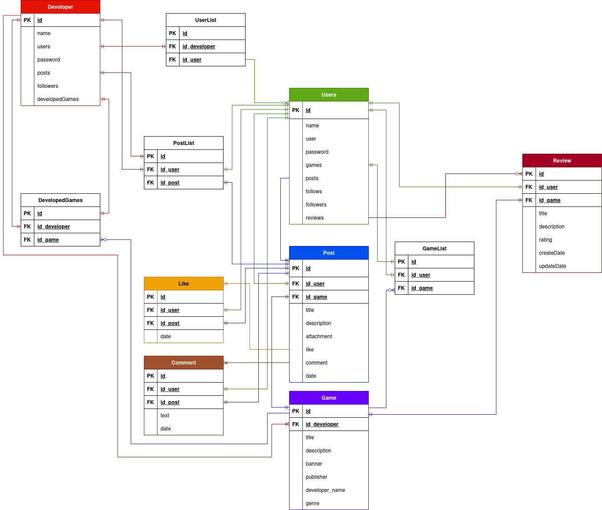

# Boceto en Figma

[Steamgram - Figma](https://www.figma.com/design/6fCEATWz4yeyrRqu8JbWro/Steamgram?node-id=10-441&t=x6dJ7rZ1uQpbZ9de-1)

# Diagrama de casos de uso

    

# Diagrama de entidad-relación

    

